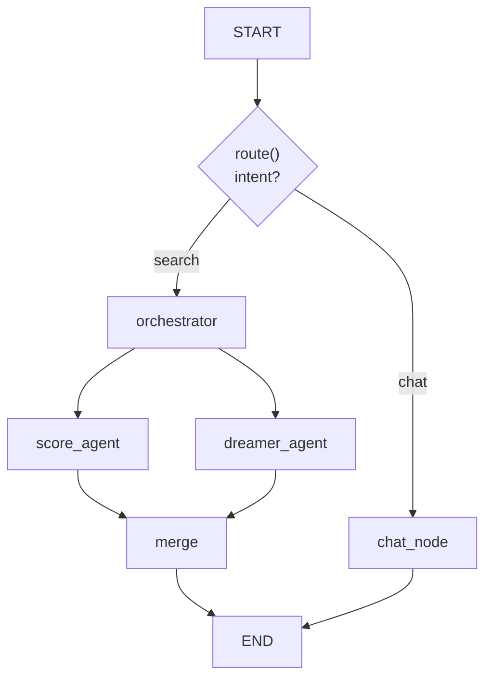

# CareerLens

AI-powered job matching. You give it a target role, your preferences and your
resume; a LangGraph multi-agent pipeline searches live job listings, scores each
one against your actual background, and splits the results into **realistic
matches** and **stretch goals**. You can then chat with the results — the
conversation is grounded in the jobs that were just found, and it survives a
page reload.

---

## How it works



| Node | Model | What it does |
|---|---|---|
| `orchestrator` | Haiku 4.5 | Expands your role into search keywords, reads `additional_context` for signals, calls the Adzuna API, filters down to the top 30 listings, stamps a `run_id` and a search-run marker message. |
| `score_agent` | Sonnet 5 | Scores listings you could realistically get today → `realistic_matches`. |
| `dreamer_agent` | Sonnet 5 | Scores ambitious listings worth growing into → `stretch_matches`. |
| `merge` | — | Deterministic: sorts each list by `fit_score`. No LLM call by design. |
| `chat_node` | Haiku 4.5 | Q&A grounded in the current state (preferences, resume, matches) plus the conversation history. |

`score_agent` and `dreamer_agent` run **in parallel** — they write disjoint state
keys, so no reducer is needed.

### Routing

`route()` is a conditional edge (not a node — it makes no LLM call). The UI sends
`intent` explicitly:

- form submit → `intent="search"`
- chat box → `intent="chat"`

`intent` is persisted in the checkpoint, so **every** invoke must send it — a
stale value would misroute the next turn.

### Persistence

Two different things, often confused:

- **Checkpointer** (`SqliteSaver`, `job_matcher/data/checkpoints.sqlite`) —
  "what's true right now". LangGraph loads the latest snapshot for your
  `thread_id` before `START` and saves after every superstep. This is why a chat
  turn only needs to send the new message, and why results survive a browser
  refresh.
- **`thread_id` vs `run_id`** — `thread_id` is the checkpointer's key, one per
  user, and lives in `config`, not in state. `run_id` identifies one pipeline
  execution; one thread accumulates many runs over time.

`chat_history` uses the `add_messages` reducer, so messages append instead of
overwriting. `realistic_matches` / `stretch_matches` are plain overwrite fields —
a new search replaces the previous results.

---

## Setup

**Requirements:** Python 3.11+ and an Adzuna API account (free tier is enough).

```bash
git clone <repo-url>
cd langgraph_job_match_multiagent

python -m venv .venv
source .venv/bin/activate        # Windows: .venv\Scripts\activate
pip install -r requirements.txt
```

### Environment variables

Create a `.env` file in the project root:

```bash
ANTHROPIC_API_KEY=sk-ant-...
ADZUNA_APP_ID=...
ADZUNA_APP_KEY=...
```

Get Adzuna credentials at https://developer.adzuna.com/ (free, instant).
`.env` is gitignored — never commit it.

Optional, for LangSmith tracing:

```bash
LANGSMITH_TRACING=true
LANGSMITH_API_KEY=...
LANGSMITH_PROJECT=careerlens
```

### Your data

Put these in `job_matcher/data/` (the whole folder is gitignored):

| File | Required | Purpose |
|---|---|---|
| `resume.pdf` | yes* | Default resume, parsed with `pypdf`. |
| `candidate_profile_<name>.txt` | yes | Free-text background: goals, constraints, context a resume doesn't capture. |
| `checkpoints.sqlite` | auto | Created on first run. |

\* You can upload a different PDF in the UI instead; the default is only a
fallback. If you rename the profile file, update `CANDIDATE_PROFILE_PATH` in
[`app.py`](app.py).

---

## Running the app

```bash
streamlit run app.py
```

Opens at http://localhost:8501.

### Using it

1. **Sidebar → New search.** Enter a target role, remote preference, minimum
   salary + currency, base location, and optionally a resume PDF and free-text
   context ("career-change motivation, industries to avoid, salary context").
2. **Find matches.** A status block shows each node as it completes. Takes ~30–60s
   — two agents are scoring 30 listings.
3. **Read the results.** Metric cards up top (role, jobs scanned, match counts,
   top score) and the searched keywords as badges. Job cards sit under two tabs:
   *Realistic matches* and *Stretch goals*. Each card shows a colour-coded fit
   score (green ≥80, orange ≥60), location, salary, the agent's reasoning, and an
   expandable gap suggestion — "how to close the gap" for realistic roles,
   "roadmap to get there" for stretch ones.
4. **Chat about them** in the right-hand panel: why a job scored the way it did,
   how your resume lines up, what to learn next. Answers cite `job_id`s, which
   are printed on each card.
5. **Refresh freely.** The page renders from the checkpoint, so nothing is lost.

The chat box does **not** start a new search — that's deliberate. Ask it to find
new jobs and it will point you back at the form.

### Sessions

`THREAD_ID` in [`app.py`](app.py) is a fixed string (single-user app). Change it
to reset to a clean slate, or wire it to a real login when multi-user support is
needed.

---

## Project structure

```
app.py                      Streamlit UI — the only place that owns thread_id/intent
job_matcher/
  graph.py                  Graph wiring, route(), checkpointer + serde setup
  state.py                  OrchestratorState (TypedDict + reducers)
  schemas.py                Pydantic models: Preferences, JobListing, ScoredJob
  prompts.py                System prompts + context builders
  tools.py                  Adzuna client, country mapping, filter_top_jobs
  resume.py                 PDF → text
  test_graph.py             End-to-end smoke test
  nodes/
    orchestrator.py         Keyword expansion + job search
    score_agent.py          Realistic scoring
    dreamer_agent.py        Stretch scoring
    merge.py                Sort + assemble
    chat.py                 Grounded Q&A
    _common.py              Shared score → ScoredJob assembly
```

`Job_agent_CLAUDE.md` is the running design journal — every architectural decision
and the reasoning (including rejected alternatives) is recorded there.

---

## Development

### Smoke test

```bash
python -m job_matcher.test_graph
```

Runs a full search turn followed by a chat turn on a fresh `test-<uuid>` thread,
then prints the restored state. This verifies checkpoint restore, the
`add_messages` reducer, and routing — without touching your real thread.

### Adding a state field

If it's a pydantic model, add it to the serde allowlist in
[`job_matcher/graph.py`](job_matcher/graph.py):

```python
serde = JsonPlusSerializer(allowed_msgpack_modules=[
    ("job_matcher.schemas", "Preferences"),
    ...
])
```

Otherwise LangGraph logs `Deserializing unregistered type ...`, which will be
blocked in a future version.

### Inspecting checkpoints

```python
from job_matcher.graph import app
config = {"configurable": {"thread_id": "kushagra-main"}}
print(app.get_state(config).values)        # latest state
list(app.get_state_history(config))        # every superstep
```

The SQLite tables are msgpack BLOBs, not queryable SQL — don't try to use them as
a relational store.

### UI conventions

The Streamlit layer uses native elements only — no CSS injection. Theme changes
belong in `.streamlit/config.toml`.

---

## Roadmap

- [x] Multi-agent search + scoring pipeline
- [x] SQLite checkpointer, persistent sessions
- [x] Grounded chat over the current results
- [ ] `memory.py` + persist node — run history in queryable SQLite tables
- [ ] ReAct chat loop with `query_past_runs` / `get_job_by_id` tools
- [ ] Rolling conversation summary (keep 30 / trigger at 70 messages)
- [ ] Prompt caching on the chat system block
- [ ] Checkpoint pruning (old runs + leftover `test-*` threads)
